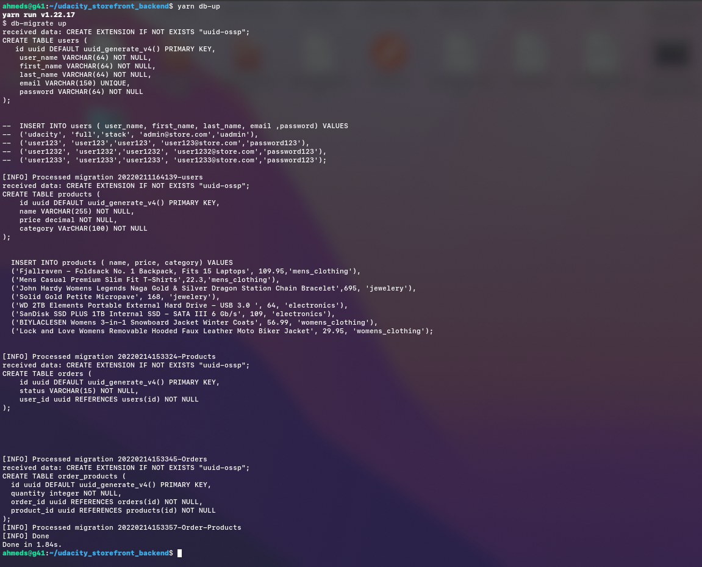
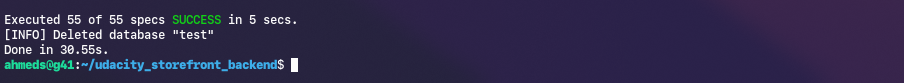
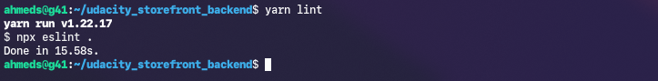

# Build-a-Storefront-Backend- ==> Udacity Project 

A node express server application providing restful api endpoints to manage products and user orders for an online store.

## Table of Contents

- [General Info](#general-information)
- [Technologies Used](#technologies-used)
- [Setup Of Node](#Setup-of-NodeJs)
- [Setup Database](#Set-up-Database)
- [Enviromental Variables Setup](##Enviromental-Variables-Set-up)
- [Migrate-UP Database](#Migrate-Database)
- [Buliding OF Project](#Buliding-OF-Project)
- [Starting the App](#Starting-the-App)
- [first time signup or registration](#1)
- [To Login And access with {EMAIL-AND-password}](#To-Login-And-access-you-should-uwe-{**EMAIL-AND-password})
- [Endpoint Access And Documentation](#Endpoint-Access-And-Documentation)
- [Running the App and other In Dev ENV](#Running-the-App-and-other-In-Dev-ENV)
- [Sources & Acknowledgements](#-Sources-&-Acknowledgements)
- [Contact & Authors](#contact-&-Authors)
- [Feedback](#Feedback)
- [Support](#Support)
- [License](#License)
- [Copyright](#Copyright)

## General Information

- This repo contains a basic Node and Express app to get you started in constructing an API. To get started, clone this repo and run `yarn` in your terminal at the project root.

## Technologies Used

**Client:**

- HTML - HTML5
- CSS - CSS3

**Server &application logic :**

- Node -v 16.13.2
- Npm -v 8.4.1
- yarn  -v 1.22.17
- Express -v 4.17.2
- Typescript -v 4.5.4
- sharp: -v 0.27.2
- dotenv -v 10.0.0
- nodemon -v 2.0.15

**Data-Base:**
- Postgres -v 14.2 
- pg -v 8.7.3
- db-migrate -v 0.11.13

**Unit Testing & Formating :**

- jasmine -v 4.0.2
- supertest -v 6.2.2
- eslint -v 8.6.0
- prettier": -v 2.5.1

**Middleware and other dependencies :**

- morgan -v 1.10.0
- helmet -v 5.0.2"
- express-rate-limit -v 6.2.1
- jsonwebtoken  v 8.5.1"
- joi -v 17.6.0
- bcrypt -v 5.0.1


## Setup of NodeJs

## Environment & Requirements

For development, you will only need Node.js and a node global package, and NPM an YARN

### Node

- #### Node installation on Windows

  Just go on [official Node.js website](https://nodejs.org/) and download the installer.
  Also, be sure to have `git` available in your PATH, `npm` might need it (You can find git [here](https://git-scm.com/)).

- #### Node installation on Ubuntu

  You can install nodejs and npm easily with apt install, just run the following commands.

      $ sudo apt install nodejs
      $ sudo apt install npm
>  Once you have npm installed you can run the following both to install and upgrade Yarn:
      $ npm install --global yarn


- #### Other Operating Systems
  You can find more information about the installation on the [official Node.js website](https://nodejs.org/) and the [official NPM website](https://npmjs.org/).

If the installation was successful, you should be able to run the following command.

    $ node --version
    ex: v8.11.3

    $ npm --version
      ex: 6.1.0

    $ yarn --version
      ex: 6.1.0  

If you need to update `npm`, you can make it using `npm`! Cool right? After running the following command, just open again the command line and be happy.

    $ npm install npm -g


## Set up Database
### Create Databases
We shall create the dev and test database.

- connect to the default postgres database as the server's root user `psql -U postgres`
- In psql run the following to create a user 
    - `CREATE USER full_stack_user WITH PASSWORD 'password123';`
- In psql run the following to create the dev and test database
    - `CREATE DATABASE full_stack_dev;`
    - `CREATE DATABASE full_stack_test;`
- Connect to the databases and grant all privileges
    - Grant for dev database
        - `\c full_stack_dev`
        - `GRANT ALL PRIVILEGES ON DATABASE full_stack_dev TO full_stack_user;`
    - Grant for test database
        - `\c full_stack_test`
        - `GRANT ALL PRIVILEGES ON DATABASE full_stack_test TO full_stack_user;`


## Enviromental Variables Set up
Bellow are the environmental variables that needs to be set in a `.env` file. This is the default setting that I used for development, but you can change it to what works for you. 

**NB:** The given values are used in developement and testing but not in production. 
```
PORT=8000
POSTGRES_HOST=127.0.0.1
POSTGRES_PORT= 5432
POSTGRES_DB=full_stack_dev
POSTGRES_TEST_DB=full_stack_test
POSTGRES_USER=full_stack_user
POSTGRES_PASSWORD=password123
BCRYPT_HASHPASS= make-it-strong
SALT_ROUNDS=10
TOKEN_SCRET=endoce_secert_token
NODE_ENV=dev
```

### Migrate Database
Navigate to the root directory and run the command below to migrate the database 

`yarn db-up`



## Buliding OF Project

Install my-project with YARN
Run Locally

Go to the project directory and open your terminal there then write:

```bash
  cd udacity_storefront_backend/
```

1. Install dependencies

```bash
       yarn
```

2. Build

```
    yarn run build
```

3. Start the server

## Starting the App

Start the server

```bash
  yarn start
```
```bash
  npm start
```

or

```bash
  yarn run start
```

> Note: Before starting the server from the dist folder using above command.The build command, in this project, only converts ts into js and put them in the dist folder.


## Token and Authentication
Tokens are passed along with the http header as 
```
Authorization   Bearer <token>

 
```
- secret key : [secret.key](secret.key)

## To first time and to can use the app you con follow :
## 1
to create a user by endpoint need to add role = admin in the header
```
curl --location --request POST 'localhost:8000/users/signup' \
--header 'role: admin' \
--header 'Content-Type: application/json' \
--data-raw '{
    "first_name": "Ahmed"           ===>string().alphanum().min(3).max(30),
    "last_name": "Sabry"        ===>string().alphanum().min(3).max(30),
    "username": "admin"             ===> string().alphanum().min(5).max(100),
    "email":"admin@store.com        ===> use only can use tlds: { allow: ['com', 'net', 'org'],
    "password": "password123"
}'

```
## To Login And access you should uwe {**EMAIL  AND    password}

> to Login a user by endpoint need to login and authenticate By EMAIL & Password:

```
curl --location --request POST 'localhost:8000/users/login' \
--header 'Content-Type: application/json' \
--data-raw '{
    
   
    "email":"admin@store.com        ===> use only can use tlds: { allow: ['com', 'net', 'org'],
    "password": "admin"             ===> string().pattern(new RegExp('^[a-zA-Z0-9]{3,30}$'),
    
}'

```

## Endpoint Access And Documentation
After you successfully run the server, you will see documntaion to use the App


>Go to [REQUIREMENT.md](REQUIREMENTS.md) file. All endpoints are described in it.  


## Running the App and other In Dev ENV

4. Develop locally

```
    yarn run dev
```
## Testing
5. Run unit tests

```
    yarn run test
```



> It sets the environment to `test`, migrates up tables for the test database, run the test then migrate down all the tables for the test database. 

## ESlint and prettier to show linting issues and fix it
6. Run ESlint and prettier to show linting issues and fix it

```
    yarn run lint
```



Run ESlint to fix linting issues

```
    yarn run lintfix
```

## prettier to formating document
Run prettier to formating document

```
    yarn run prettier
```


## Sources & Acknowledgements

- [Udacity](https://www.udacity.com/course/full-stack-web-developer-nanodegree--nd0044?utm_source=gsem_brand&utm_medium=ads_r&utm_campaign=12907727449_c&utm_term=121152421146&utm_keyword=%2Bnanodegree%20%2Bfull%20%2Bstack_b&gclid=CjwKCAiA3L6PBhBvEiwAINlJ9GGL9LHtV7IiKVOSTfXrIIJsmWAkcBUkWgPjq0cy2nc7_zfrREGrmBoC7dMQAvD_BwE)
- [How to write a Good readme](https://bulldogjob.com/news/449-how-to-write-a-good-readme-for-your-github-project)
- [Jasmine-Matchers](https://githubhelp.com/JamieMason/Jasmine-Matchers)
- [JasmineJS - Boolean Check](https://www.tutorialspoint.com/jasminejs/jasminejs_boolean_check.htm)
- [jasmine](https://jasmine.github.io/)
- [HTTP request methods](https://developer.mozilla.org/en-US/docs/Web/HTTP/Methods)
- [TypeScript](https://www.typescriptlang.org/)
- [How to Easily Update Node.js to the Latest Version](https://www.whitesourcesoftware.com/free-developer-tools/blog/update-node-js/)
- [Intro to the TSConfig Reference](https://www.typescriptlang.org/tsconfig#rootDir)
- [Node.js](https://nodejs.org/en/)
- [NPM](https://www.npmjs.com/)
- [Express](http://expressjs.com/)
- [ESLint](https://eslint.org/docs/user-guide/)
- [Prettier](https://prettier.io/docs/en/)
- [dotenv](https://www.npmjs.com/package/dotenv)
- [supertest](https://www.npmjs.com/package/supertest)

## Contact & Authors

Created by [@Ahmed Sabry](mrsabry134@gmail.com) - feel free to contact me!

- Github [@AhmedSabry70](https://github.com/AhmedSabry70/)
- Linkedin [@Ahmed Sabry](https://www.linkedin.com/in/%D9%90ahmedsabry/)

# Feedback

If you have any feedback, please reach out to us at mrsabry134@gmail.com

## Support

For support, email mrsabry134@gmail.com

## License

Distributed under the MIT License. See LICENSE for more information.[MIT](/LICENSE.txt)

## Copyright

&copy; http://ahmedsabry.tk, Inc. All rights reserved.
